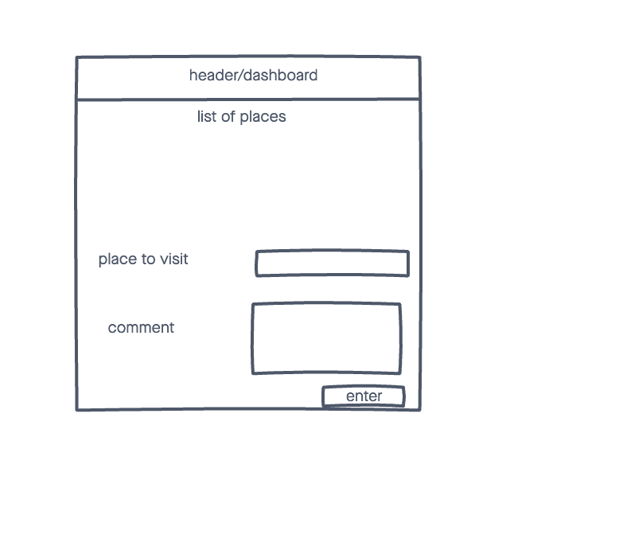
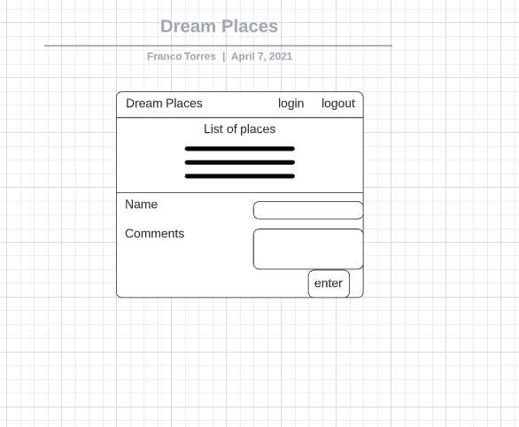
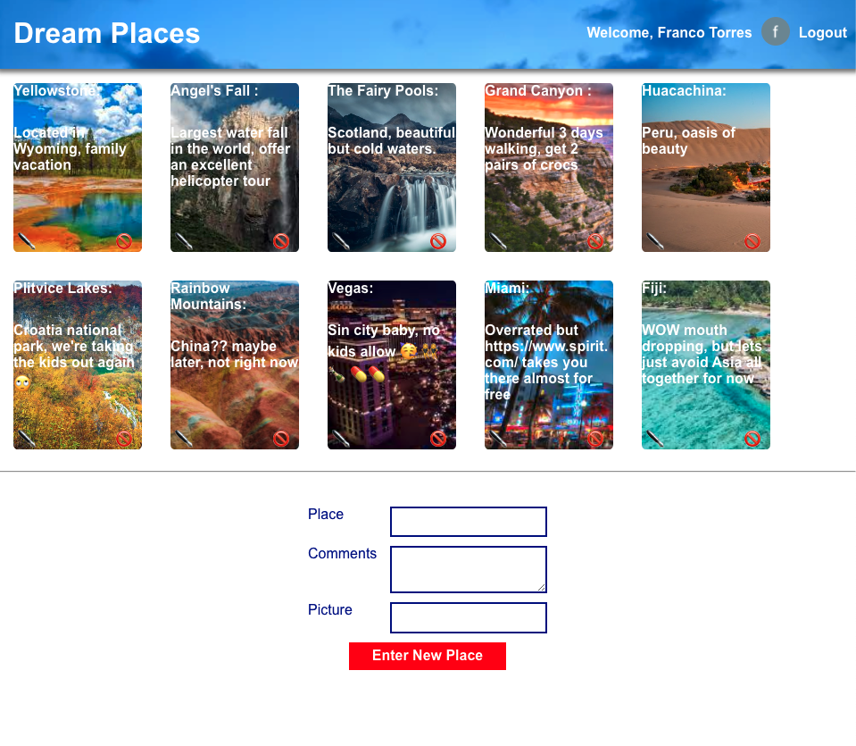

# Project 3

A simple web app that enter information of the places one will like to visit.

## technologies Used
- Invision (wireframe)
- lucy.app (ERD)
- Trello Board (https://trello.com/b/GAhArwda/project-3)
- HTML5
- CSS3
- Node.js
- Express
- MongoDB 
- Github Pages (for saving)
- Heroku Pages (for deployment)
- React
- Firebase

## Screenshots

## Getting started
[click]() here to get started and see the app online! 

## Future Enhancements

